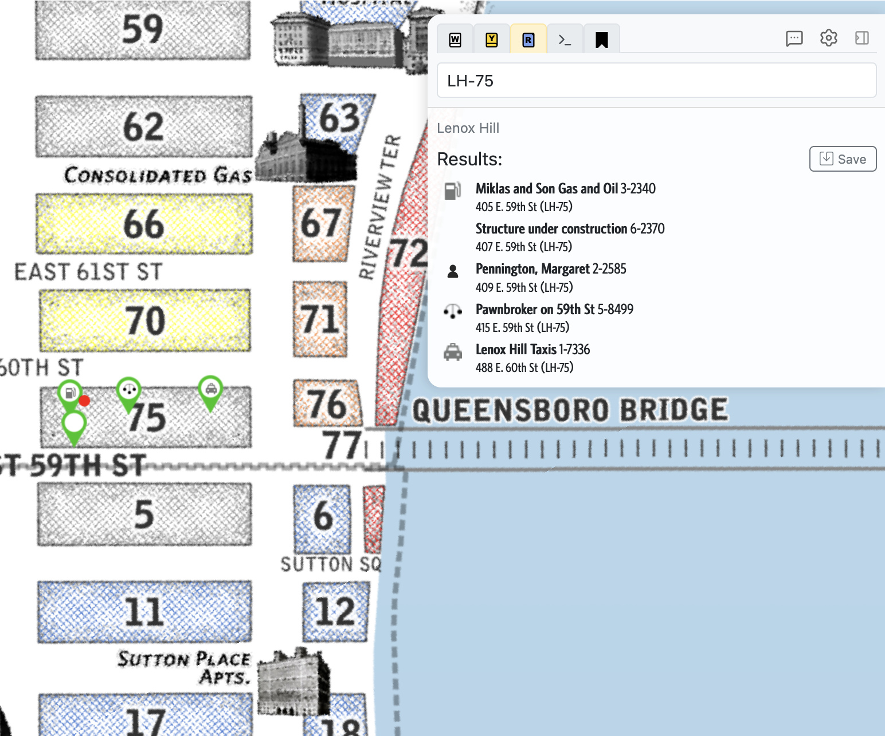
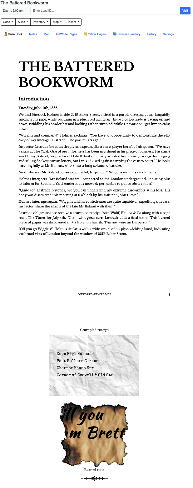

# Metagame

Metagame is an online tool for Sherlock Holmes Consulting Detective style mystery/puzzle *"choose your own adventure with a map and a phonebook"* games. It currently supports Sherlock Holmes, Mythos Tales, and New York Noir.

# Features

## Interactive Map

Metagame provides an online map with convenient features for players (including Directories for People and Businesses, and an easy-to-use 'What is Here' Reverse Directory system).

## Online Gameplay

Metagame offers the ability to play cases entirely online through the online gameplay interface. The interface lets you take notes and organise your thoughts and theories, search the map, scan through directories, read and annotate case books online (fan and free cases only, retail case books are not available online).

## Tools for Authors

## Building Your Case
For authors, Metagame's shines with advanced searching and bookmarking capabilities (find suitable locations for your characters with distance-related searches, searches by type of business, etc), as well as the ability to take notes on locations and then export those notes into your writing tools.

### Play Testing
For authors, the online gameplay features provide an exciting way to get player feedback: players can share their gameplay records with you which will show how they navigated your cases, what searches they ran, notes they took (including the ability to report mistakes), and the ability to show visually on a map every location they visited.

If you're an author and would like to use Metagame to help develop your next case, please reach out to me, I'd love to help!

## Supported Games

| System | Links | 
| --- | --- |
| Sherlock Holmes Consulting Detective | [play online](https://noir.levitime.com/g/game?system=shcd&case=tutorial), [online map](https://noir.levitime.com/g/map?system=shcd) |
| Mythos Tales | [play online](https://noir.levitime.com/g/game?system=mythos&case=there_and_back_again), [online map](https://noir.levitime.com/g/map?system=mythos) |
| [New York Noir](https://www.nynoir.org) | game under development, limited to [online map](https://noir.levitime.com/g/map?system=nynoir) |

# Screenshots

## Casebook

Metagame is especially useful to support authors using [Casebook](https://github.com/dcmouser/casebook), a tool to help author cases for New York Noir, Sherlock Holmes Consulting Detective, and other SHCD-style games.

Casebook produces beautifully typeset PDFs in a variety of formats for your case.
